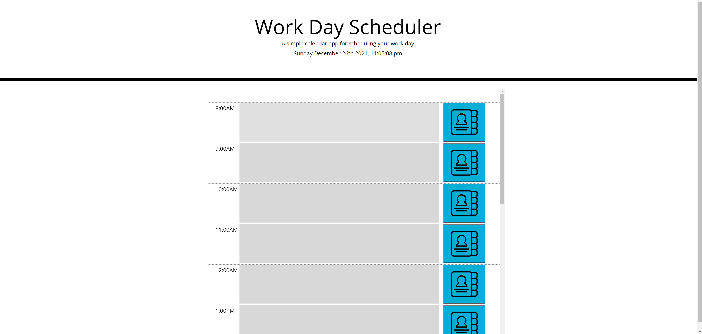
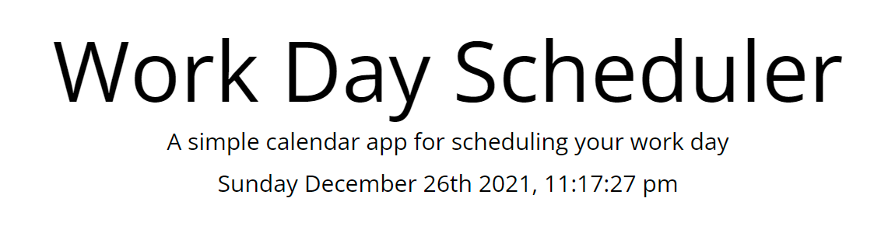
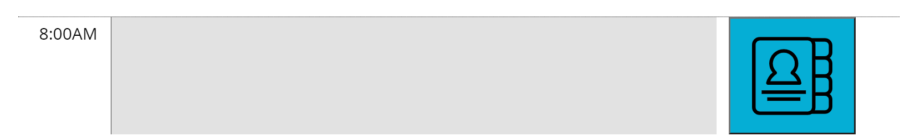

# Task Calendar

## The Repository

This repository contains the source code for the Task Calendar Project.

## Task Calendar

Never lose track of an important meeting or deadline again! With Task Calendar, users can keep track of important events and better manage their time.

This application provided me with a great oportunity to become more familiar with third-party frameworks in general, in particular Bootstrap, which shortened the development time of this app.

With some experience using relational and non-relational databases under my belt, I plan to revisit this application in the future and implement database storage in lieu of local storage for storing tasks. I also believe there are several opportunities for UI enhancement, such as implementing a grid-style layout using CSS grid and modal display when a particular time is selected.

## Usage

Usage is simple. The current day is displayed in real-time at the top of the page, as shown in below.

Directly below, the user will find timeblocks within which he or she can enter tasks. Each box is color-coded based on its position relative to the current time, i.e. past times are red, the current time is green, and future times are blue. Hitting enter will save the textbox content in the browser's local storage.

Hitting the adjacent blue button seen in the screenshot above will display a prompt containing all previously inputted tasks. Clicking anywhere on the page closes the prompt.

## Utilizes:

- HTML
- CSS
- Bootstrap
- JavaScript
- JQuery

## Deployed Application

the deployed application can be found by following the link below.

https://rrich-kray.github.io/task-calendar/

## Feedback

Leave comments/suggestions in the Slack channel!

## License

Copyright (c) 2022, Ryan Kray
All rights reserved.

This source code is licensed under the BSD-style license found in the LICENSE file in the root directory of this source tree and reproduced below.

Redistribution and use in source and binary forms, with or without modification, are permitted provided that the following conditions are met:

1. Redistributions of source code must retain the above copyright notice, this list of conditions and the following disclaimer.
2. Redistributions in binary form must reproduce the above copyright notice, this list of conditions and the following disclaimer in the documentation and/or other materials provided with the distribution.
3. All advertising materials mentioning features or use of this software must display the following acknowledgement: This product includes software developed by Ryan Kray.
4. Neither the name of this application's developer nor the names of its contributors may be used to endorse or promote products derived from this software without specific prior written permission.

THIS SOFTWARE IS PROVIDED BY THE COPYRIGHT HOLDER ''AS IS'' AND ANY EXPRESS OR IMPLIED WARRANTIES, INCLUDING, BUT NOT LIMITED TO, THE IMPLIED WARRANTIES OF MERCHANTABILITY AND FITNESS FOR A PARTICULAR PURPOSE ARE DISCLAIMED. IN NO EVENT SHALL THE COPYRIGHT HOLDER OR CONTRIBUTORS BE LIABLE FOR ANY DIRECT, INDIRECT, INCIDENTAL, SPECIAL, EXEMPLARY, OR CONSEQUENTIAL DAMAGES (INCLUDING, BUT NOT LIMITED TO, PROCUREMENT OF SUBSTITUTE GOODS OR SERVICES; LOSS OF USE, DATA, OR PROFITS; OR BUSINESS INTERRUPTION) HOWEVER CAUSED AND ON ANY THEORY OF LIABILITY, WHETHER IN CONTRACT, STRICT LIABILITY, OR TORT (INCLUDING NEGLIGENCE OR OTHERWISE) ARISING IN ANY WAY OUT OF THE USE OF THIS SOFTWARE, EVEN IF ADVISED OF THE POSSIBILITY OF SUCH DAMAGE.
